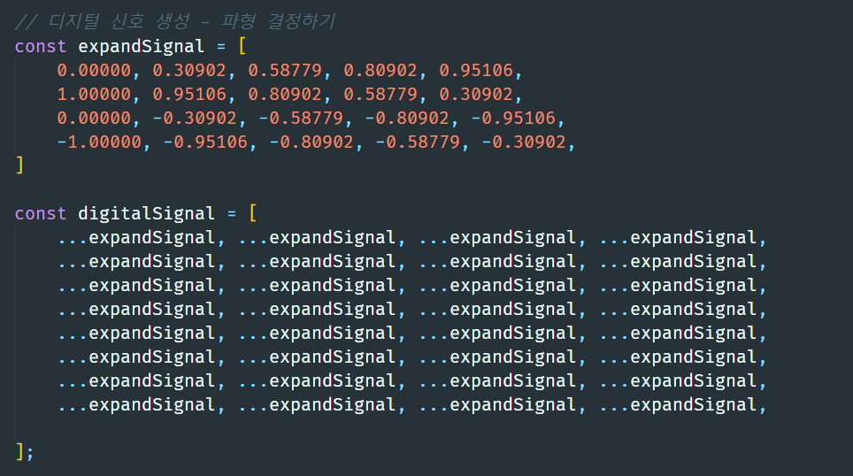
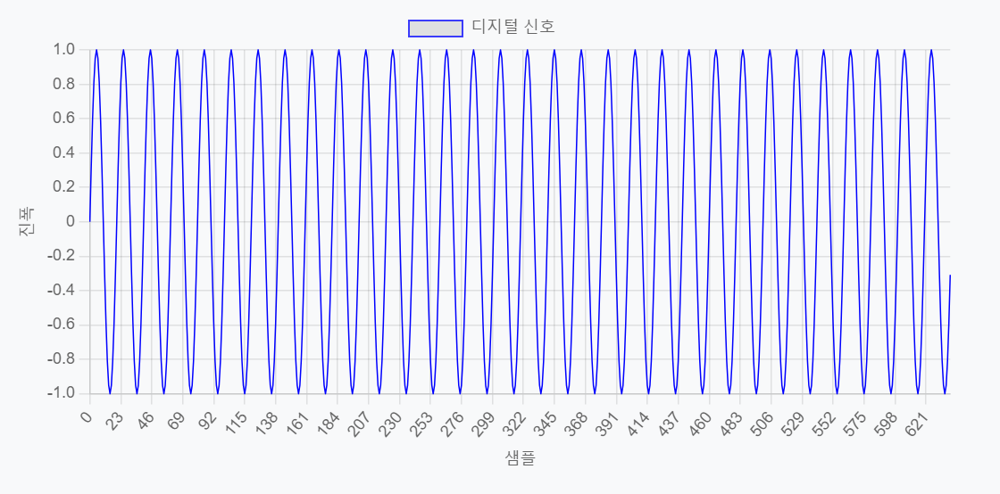
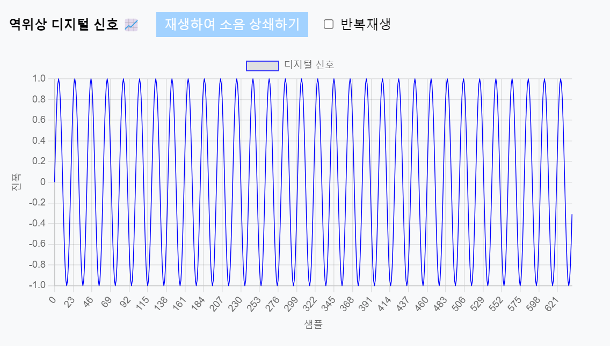

# Oasis Hackerton 5 🐳 / 🚇공사 소음 상쇄 프로젝트🏗️

## 팀원구성

| **임재윤** | **정권희** | **박기정** | **조나경** |
| :------: |  :------: | :------: | :------: |
|기획|개발|개발|디자인|

## 기간

### 8월 14일 ~ 16일
- 아이디어 회의 및 선정
- (세부 내용 추가 예정)

### 8월 17일 ~ 20일
- 인공지능 모델 학습을 위한 효율성 분석 LSTM, CNN
- (자료 및 세부 내용 추가 예정)

### 8월 17일 ~ 18일
- 데이터 시각화를 위한 웹 서비스 개발 계획
- 시각화와 동시에 역위상 출력기능 탑재 계획
- Flask서버 구현 및 메인 페이지 구성

### 8월 19일
- 디지털 데이터를 소리 데이터로 표현하는 방식에 표현
- 개발팀원에게 파동의 모양에 대한 데이터를 받고 이를 시각화 하는데 성공함
  
(다음은 샘플 데이터임)

(차트를 이용한 시각화)

### 8월 20일
- 시각화한 데이터를 음성으로 출력하기 위해 AudioContect 연구 및 공부
- 구현 완료(인공지능 모델에 대한 완성이 아직 진행 중인 관계로 테스트 X)

